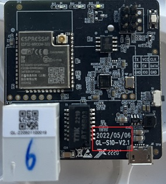
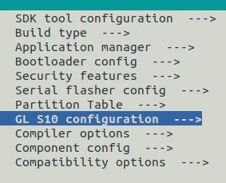
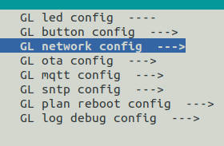
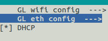
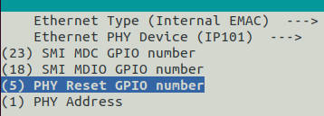

# Introduction

In order to adapt to the network  phy chip and the RMII clock scheme, we patched the ESP-IDF. The network phy chip and RMII clock scheme are  determined by reading and writing the hardware version number in efuse. The hardware version number is 1 byte of EFUSE_BLK3 in efuse whose start bit is 176.  

If the hardware version number is 0x00, the phy chip is lan8720, and output the RMII clock from internal.

If the hardware version number is 0x01, reserved for the phy chip is ip101, and output RMII clock from internal.

If the hardware version number is 0x02, the phy chip is ip101, and input RMII clock from external crystal.

At present, the latest board version is GL-S10-V2.1, the phy chip ip101 and input RMII clock from external crystal, and its hardware version number is 0x02. Before board version GL-S10-V2.1, the phy chip lan8720 was used to output the RMII clock from internally, and its hardware version number is 0x00. 



# How to patch

patch IDF version：

```shell
cd ~
git clone --recursive https://github.com/espressif/esp-idf.git
cd esp-idf
git reset --hard c327a0016eaea7b3fd54fb00a9d88211b70b4643
```

patch API ：

```c
/**
* @brief: Original API
**/
esp_eth_mac_t *esp_eth_mac_new_esp32(const eth_mac_config_t *config)
    
/**
* @brief: After API
* @param: is_clk_in(hardware version number)
*		  0x00: output RMII clock from internal, the phy chip is lan8720
*		  0x01: reserved for output RMII clock from internal, the phy chip is ip101
*		  0x02: input RMII clock from external crystal, the phy chip is ip101
**/
esp_eth_mac_t *esp_eth_mac_new_esp32(const eth_mac_config_t *config, uint8_t is_clk_in)
```


1. Go to the esp-idf directory and use the following command, where [patch file path] is changed to the path where you store the patch file.

```shell
$ git am [patch file path]/0001-GL-iNet-patch-support-software-setting-phy-clk-mode-.patch
```


2. Show how to detemine the network phy chip and RMII clock scheme by hardware version number.

```c
uint8_t dev_hw_ver;
uint8_t is_clk_in = 0;

typedef enum{
    VER_0_LAN8720_OUT    = 0,
    VER_1_IP101_OUT      = 1,
    VER_2_IP101_IN       = 2,
}gl_dev_ver;
......
if(dev_hw_ver == VER_0_LAN8720_OUT)
{
    phy = esp_eth_phy_new_lan8720(&phy_config);
}else if((dev_hw_ver == VER_1_IP101_OUT) || (dev_hw_ver == VER_2_IP101_IN)){
    phy = esp_eth_phy_new_ip101(&phy_config);
}
```

You can use the example [basic](./basic) to better understand the patches.
# menuconfig

```shell
cd  ~/gl-s10-ble-gateway/project/gl_s10_v2_0/idf.py menuconfig
```

Configure as shown below:









